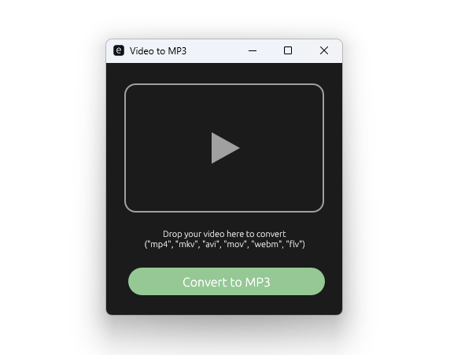

# Vid2MP3

A simple video to MP3 converter with a modern GUI built in Rust.


## Features

- **Drag & Drop** - Simply drag your video file into the app
- **High Quality** - Converts to MP3 with 192kbps bitrate
- **Video Preview** - Shows thumbnail from your video
- **Fast & Lightweight** - Built with Rust for optimal performance
- **Modern UI** - Clean, intuitive dark mode interface
- **Cross-Platform** - Works on Windows, macOS, and Linux
- **Silent Operation** - No console windows popping up

## Supported Formats

**Input:** MP4, MKV, AVI, MOV, WebM, FLV

**Output:** MP3 (192kbps)

## Screenshots



_Clean and simple interface_

## Installation 🔧

### Prerequisites

You need to have **FFmpeg** installed on your system:

#### Windows

```bash
# Using Chocolatey
choco install ffmpeg

# Or download from: https://ffmpeg.org/download.html
```

#### macOS

```bash
brew install ffmpeg
```

#### Linux

```bash
# Ubuntu/Debian
sudo apt install ffmpeg

# Fedora
sudo dnf install ffmpeg

# Arch
sudo pacman -S ffmpeg
```

### Download

Download the latest release from the [Releases](https://github.com/yourusername/vid2mp3/releases) page.

Or build from source:

```bash
git clone https://github.com/hmrnsp/vid2mp3.git
cd vid2mp3
cargo build --release
```

The executable will be in `target/release/vid2mp3` (or `vid2mp3.exe` on Windows).

## Usage

1. **Launch the application**
2. **Drag and drop** a video file onto the window, or **click the drop zone** to browse files
3. Wait for the thumbnail to load (optional preview)
4. Click **"Convert to MP3"**
5. Done! Click the 📂 icon to open the output location

The MP3 file will be saved in the same directory as the original video.

## Building from Source

### Requirements

- Rust 1.70 or higher
- FFmpeg installed on your system

### Build Steps

```bash
# Clone the repository
git clone https://github.com/hmrnsp/vid2mp3.git
cd vid2mp3

# Build release version
cargo build --release

# Run
cargo run --release
```

### Cross-Compilation

```bash
# For Windows from Linux
cargo build --release --target x86_64-pc-windows-gnu

# For Linux from Windows (requires setup)
cargo build --release --target x86_64-unknown-linux-gnu
```

## Technical Details

### Built With

- **[Rust](https://www.rust-lang.org/)** - Programming language
- **[eframe/egui](https://github.com/emilk/egui)** - Immediate mode GUI framework
- **[tokio](https://tokio.rs/)** - Async runtime
- **[FFmpeg](https://ffmpeg.org/)** - Video processing backend
- **[rfd](https://github.com/PolyMeilex/rfd)** - Native file dialogs

### Architecture

- **GUI Layer**: eframe/egui for cross-platform UI
- **Async Processing**: Tokio for non-blocking FFmpeg operations
- **Video Processing**: FFmpeg for conversion and thumbnail extraction
- **File Handling**: Native file dialogs with rfd

### Key Features Implementation

- **No Console Window**: Uses `CREATE_NO_WINDOW` flag on Windows to prevent terminal flashing
- **Thumbnail Generation**: Extracts frame at 1 second using FFmpeg
- **Async Operations**: All heavy operations run asynchronously to keep UI responsive
- **Cross-Platform**: Conditional compilation for OS-specific features

## Project Structure

```
vid2mp3/
├── src/
│   └── main.rs          # Main application code
├── assets/
│   └── icon.ico         # Application icon
├── build.rs             # Build script for Windows resources
├── Cargo.toml           # Rust dependencies
└── README.md            # This file
```

## Contributing

Contributions are welcome! Please feel free to submit a Pull Request.

1. Fork the project
2. Create your feature branch (`git checkout -b feature/AmazingFeature`)
3. Commit your changes (`git commit -m 'Add some AmazingFeature'`)
4. Push to the branch (`git push origin feature/AmazingFeature`)
5. Open a Pull Request

## Roadmap

- [ ] Batch conversion support
- [ ] Custom output directory selection
- [ ] Bitrate selection (128/192/256/320 kbps)
- [ ] Format selection (MP3, AAC, OGG, FLAC)
- [ ] Progress bar with time estimation
- [ ] Dark/Light theme toggle
- [ ] Localization (multi-language support)

## License

This project is licensed under the MIT License - see the [LICENSE](LICENSE) file for details.

## Acknowledgments

- FFmpeg team for the amazing video processing tool
- egui community for the excellent GUI framework
- Rust community for the great ecosystem

## Support

If you encounter any issues or have questions:

- Open an [Issue](https://github.com/hmrnsp/vid2mp3/issues)
- Check existing issues for solutions
- Ensure FFmpeg is properly installed

---

Made with ❤️ and 🦀 Rust

**Star ⭐ this repo if you find it useful!**
